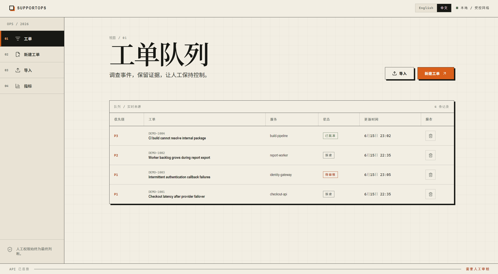
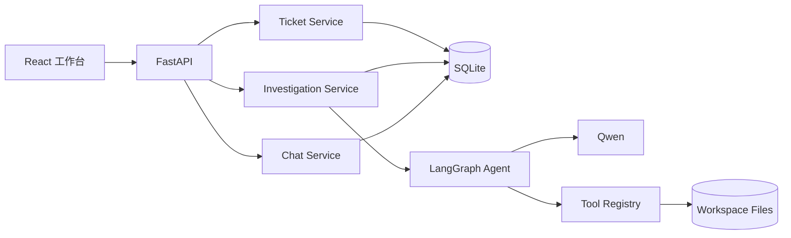

# TriageOps Agent Lab

<p align="center">
  <strong>面向技术支持与运维排障场景的证据驱动 AI 工单调查工作台。</strong>
</p>

<p align="center">
  <a href="https://github.com/NIYAOYE/triageops-agent-Lab">项目仓库</a>
  ·
  <a href="#快速开始">快速开始</a>
  ·
  <a href="#接口">接口</a>
  ·
  <a href="#测试">测试</a>
</p>

<p align="center">
  
  
  
  
</p>

TriageOps Agent Lab 使用 **FastAPI**、**SQLite**、**LangGraph**、**Qwen Function Calling** 和 **React**，把工单接入、受控工具调用、证据记录、结构化诊断、审计追踪和人工审批串成一条可复查的调查流程。

> 主页截图预留路径：请将截图命名为 `triageops-workbench.png`，放到 `assets/` 目录。README 已经引用 `assets/triageops-workbench.png`，上传后会直接显示。



## 亮点

- 支持手动创建、CSV/JSON 批量导入、列表查看、详情查看和删除工单。
- 支持受控文本附件上传，校验文件类型、大小、路径、编码和二进制内容。
- 基于 LangGraph 的工具调用循环，接入搜索、文件读取、Python 执行、日志扫描、JSON 查询和 CSV 概览。
- 调查流程会沉淀证据、诊断报告、事件流、完整工具审计和人工审批记录。
- React/Vite 工作台提供工单队列、导入、指标、审计和删除操作。
- `sample_data/supportops/` 提供合成工单和附件，方便本地演示工具能力。

## 架构



## 快速开始

```powershell
conda activate agent
python -m pip install -e . --no-build-isolation

cd frontend
npm install
```

设置模型和搜索服务密钥：

```powershell
$env:DASHSCOPE_API_KEY="your-dashscope-api-key"
$env:TAVILY_API_KEY="your-tavily-api-key"
```

写入四条内置合成工单：

```powershell
supportops-seed
```

启动后端：

```powershell
$env:PYTHONPATH=(Resolve-Path .\src)
uvicorn tool_use_agent.composition:create_application --factory --host 127.0.0.1 --port 8000
```

另开终端启动前端：

```powershell
cd frontend
npm run dev
```

浏览器访问 `http://127.0.0.1:5173/tickets`。

## 演示数据

导入示例 JSON 工单：

```powershell
curl.exe -X POST http://127.0.0.1:8000/v1/tickets/import `
  -F "file=@sample_data/supportops/tickets.json"
```

上传一个示例附件：

```powershell
curl.exe -X POST http://127.0.0.1:8000/v1/tickets/INC-2001/attachments `
  -F "file=@sample_data/supportops/attachments/INC-2001/orders-api.log;type=text/plain"
```

更多示例文件见 `sample_data/supportops/README.md`。

## 接口

| Method | Path | 用途 |
| --- | --- | --- |
| `POST` | `/v1/tickets` | 创建工单 |
| `GET` | `/v1/tickets` | 分页、筛选和排序工单 |
| `GET` | `/v1/tickets/{id}` | 查看工单详情和当前诊断摘要 |
| `DELETE` | `/v1/tickets/{id}` | 删除工单及其调查记录 |
| `POST` | `/v1/tickets/import` | 原子导入 CSV 或 JSON 工单 |
| `POST` | `/v1/tickets/{id}/attachments` | 上传受控文本附件 |
| `POST` | `/v1/tickets/{id}/investigations` | 启动或重试调查 |
| `GET` | `/v1/investigations/{id}` | 查看证据、诊断、事件和审批 |
| `GET` | `/v1/investigations/{id}/events` | 恢复调查 SSE 事件流 |
| `GET` | `/v1/investigations/{id}/audits` | 查看完整工具调用审计 |
| `POST` | `/v1/investigations/{id}/decision` | 批准、编辑后批准或退回诊断 |
| `GET` | `/v1/metrics/diagnosis-time` | 查看首次诊断耗时指标 |

删除工单：

```powershell
curl.exe -X DELETE http://127.0.0.1:8000/v1/tickets/INC-2001
```

## 工具

| Tool | 用途 |
| --- | --- |
| `web_search` | 使用 Tavily 搜索并返回来源 URL |
| `read_file` | 读取工作区内的文本文件 |
| `python_exec` | 在临时目录中执行受限 Python 分析代码 |
| `log_scan` | 按关键词或正则扫描日志并返回上下文 |
| `json_query` | 从工作区 JSON 文件读取点路径字段 |
| `csv_profile` | 汇总 CSV 列、空值、重复值、样本和分组计数 |

## 项目结构

```text
src/tool_use_agent/
  agent/             LangGraph 状态、提示词和工具循环
  api/               FastAPI 路由和响应契约
  investigations/    证据、诊断、审批和事件流
  memory/            会话、消息、摘要和工具审计
  tickets/           工单模型、仓储、服务、导入和附件
  tools/             搜索、文件、Python、日志、JSON 和 CSV 工具
frontend/            React/Vite 工作台
sample_data/         合成工单和附件
tests/               Python 单元和集成测试
```

## 测试

后端：

```powershell
$env:PYTHONPATH=(Resolve-Path .\src)
python -m pytest -m "not live" -q
python -m compileall -q src tests
```

前端：

```powershell
cd frontend
npm run test
npm run build
```

真实服务冒烟测试需要显式运行，并会消耗 Qwen/Tavily 配额：

```powershell
python -m pytest tests/live/test_live_smoke.py -m live -q -s
```

## 边界

- 当前应用没有内置用户认证，面向本地或受控内网演示，不应直接暴露到公网。
- Agent 只提供调查辅助和回复草稿，不会自动关闭工单或执行生产修复。
- `python_exec` 适合本地受控分析，不是生产级恶意代码沙箱。
- `agent.db`、`workspace/`、API Key、本地环境文件和上传附件不应提交到 Git。
