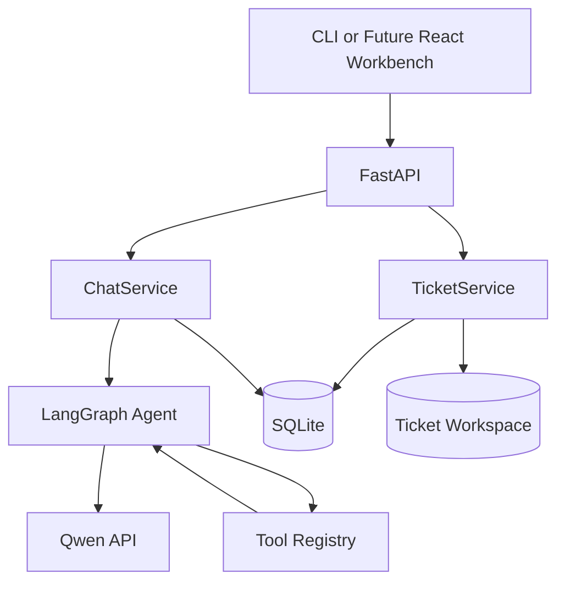

# TriageOps Agent Lab

TriageOps Agent Lab 是一个面向研发与运维技术支持场景的 AI 工单调查实验项目。
它使用 LangGraph、Qwen、FastAPI 和 SQLite，将工单接入、受控工具调用、证据记录、
结构化诊断与人工审批组织成可追踪的调查流程。

当前已完成工单领域底座和工单接入 API。结构化调查 Runner、调查事件流、审批接口、
指标看板与 React 工作台仍在后续阶段开发。

> MVP 不包含 RAG、向量数据库、自动执行生产修复、自动关闭工单或真正的多 Agent 运行时。

## Current Progress

### Completed

- 通用 LangGraph Tool-Use Agent 与 Qwen Function Calling
- Tavily 网页搜索、受限文件读取和受限 Python 执行
- SQLite 会话、消息、摘要和工具审计持久化
- 工单、附件、调查、证据、诊断报告和审批领域模型
- 工单状态机与领域关系约束
- 手动创建、分页、筛选、排序和详情 API
- CSV/JSON 原子批量导入
- 受控文本附件上传与工单隔离存储
- FastAPI 普通响应、聊天 SSE 与稳定工单错误体

### Next

- Phase 3：结构化调查 Runner 与 `DiagnosisReport` 输出验证
- Phase 4：调查 SSE、恢复、重试、审批和首次诊断时间 API
- Phase 5-7：React 工业调查工作台、导入视图、指标和审计详情
- Phase 8：演示数据、真实 API 验证和安全硬化

## Architecture



核心目录：

- `src/tool_use_agent/agent/`：LangGraph 状态、提示词和工具调用循环
- `src/tool_use_agent/tools/`：搜索、文件读取、Python 执行和工具注册
- `src/tool_use_agent/memory/`：会话、消息、摘要和工具审计仓库
- `src/tool_use_agent/tickets/`：工单模型、状态机、SQLite 仓库和服务层
- `src/tool_use_agent/investigations/`：调查、证据、诊断报告和审批模型
- `src/tool_use_agent/api/`：聊天与工单 REST/SSE 接口
- `src/tool_use_agent/composition.py`：运行时配置和依赖装配
- `tests/`：单元、集成和显式 live 测试

## Requirements

- Python 3.12
- Qwen-compatible DashScope API key
- Tavily API key

安装项目：

```powershell
python -m venv .venv
.\.venv\Scripts\Activate.ps1
python -m pip install -e . --no-build-isolation
```

也可以使用已有的 Python 3.12 conda 环境：

```powershell
conda activate agent
python -m pip install -e . --no-build-isolation
```

设置 API Key：

```powershell
$env:DASHSCOPE_API_KEY="your-dashscope-api-key"
$env:TAVILY_API_KEY="your-tavily-api-key"
```

其他配置参考 `.env.example`。默认数据库为 `agent.db`，默认运行时工作目录为
`workspace/`。数据库、附件、密钥和本地环境文件均不应提交到 Git。

## Run

启动服务：

```powershell
uvicorn tool_use_agent.composition:create_application --factory `
  --host 127.0.0.1 --port 8000
```

健康检查：

```powershell
curl.exe http://127.0.0.1:8000/health
```

启动终端聊天客户端：

```powershell
tool-agent --base-url http://127.0.0.1:8000
```

## Ticket API

| Method | Path | Purpose |
| --- | --- | --- |
| `POST` | `/v1/tickets` | 手动创建工单 |
| `GET` | `/v1/tickets` | 分页、筛选和排序工单 |
| `GET` | `/v1/tickets/{id}` | 获取工单、当前调查和诊断摘要 |
| `POST` | `/v1/tickets/import` | 原子导入 CSV/JSON 工单 |
| `POST` | `/v1/tickets/{id}/attachments` | 上传受控文本附件 |

聊天 API 保持可用：

| Method | Path | Purpose |
| --- | --- | --- |
| `POST` | `/v1/sessions` | 创建聊天会话 |
| `GET` | `/v1/sessions/{id}` | 获取会话 |
| `GET` | `/v1/sessions/{id}/messages` | 获取消息历史 |
| `POST` | `/v1/chat` | 获取完整回答 |
| `POST` | `/v1/chat/stream` | 获取 SSE 事件流 |

### Create A Ticket

```powershell
$ticket = @{
  id = "INC-1042"
  title = "Database connection timeouts"
  description = "Requests fail while acquiring a database connection."
  environment = "production"
  service = "orders-api"
  priority = "P1"
  category = "runtime/database"
} | ConvertTo-Json

Invoke-RestMethod -Method Post `
  -Uri http://127.0.0.1:8000/v1/tickets `
  -ContentType "application/json" `
  -Body $ticket
```

### List Tickets

```powershell
Invoke-RestMethod `
  "http://127.0.0.1:8000/v1/tickets?status=NEW&priority=P1&page=1&page_size=20"
```

### Import Tickets

JSON 文件必须包含对象数组：

```json
[
  {
    "id": "INC-1043",
    "title": "CI dependency conflict",
    "description": "The build fails after dependency resolution.",
    "environment": "staging",
    "service": "build-pipeline",
    "priority": "P2",
    "category": "build/dependency"
  }
]
```

CSV 必填列为：

```text
id,title,description,environment,service,priority
```

上传导入文件：

```powershell
curl.exe -X POST http://127.0.0.1:8000/v1/tickets/import `
  -F "file=@tickets.json"
```

导入会先校验整批数据。字段缺失、无效优先级、空批次或重复 ID 会使整批失败，
不会产生部分写入。

### Upload An Attachment

```powershell
curl.exe -X POST http://127.0.0.1:8000/v1/tickets/INC-1042/attachments `
  -F "file=@orders.log;type=text/plain"
```

允许 `.log`、`.txt`、`.csv` 和 `.json` 文本附件。服务会校验扩展名、媒体类型、
文本编码、二进制特征、单文件大小和单工单累计大小，并将文件保存到隔离目录。

## Error Contract

工单 API 的领域错误使用稳定结构：

```json
{
  "code": "ticket_not_found",
  "message": "Ticket INC-1042 was not found.",
  "request_id": "...",
  "details": {
    "ticket_id": "INC-1042"
  }
}
```

常见状态码：

- `400`：导入格式或附件类型错误
- `404`：工单不存在
- `409`：工单 ID 或状态冲突
- `413`：导入文件或附件超过限制
- `422`：请求字段校验失败

## Test

默认测试不会访问真实付费 API：

```powershell
python -m pytest -m "not live" -q
python -m compileall -q src tests
```

当前开发基线为 `120 passed, 1 skipped, 3 deselected`。

设置真实 API Key 后，可显式运行 live 冒烟测试：

```powershell
python -m pytest tests/live/test_live_smoke.py -m live -q -s
```

live 测试会消耗 Qwen 与 Tavily 配额。

## Security Boundaries

- API 当前没有认证和限流，仅适合本地或受控内网环境。
- `read_file` 拒绝绝对路径、路径穿越、符号链接越界、二进制文件和超大文件。
- 工单附件按工单隔离，并限制扩展名、媒体类型、文本特征和大小。
- `python_exec` 使用 AST 检查、隔离进程、独立临时目录、超时和输出截断。
- `python_exec` 不是生产级恶意代码沙箱；不可信代码应放入容器或虚拟机执行。
- Agent 只生成调查建议，不会自动执行生产修复或关闭工单。

## Repository

[NIYAOYE/triageops-agent-Lab](https://github.com/NIYAOYE/triageops-agent-Lab)
