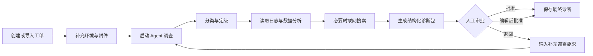
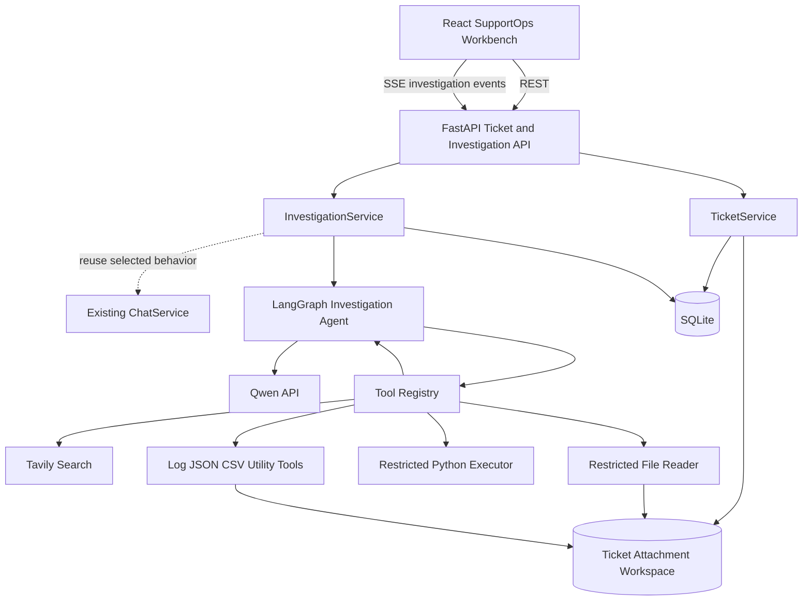
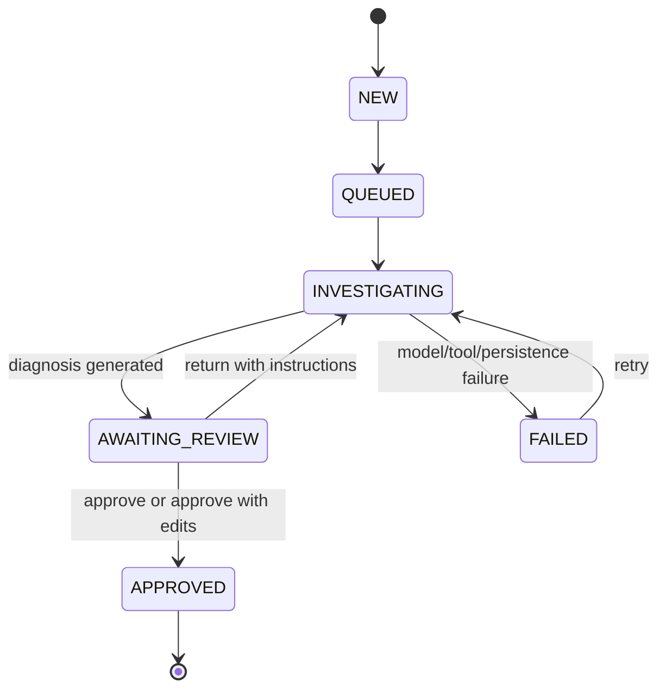

# SupportOps Evolution Plan

> 本文档是 ToolUse-Agent-Lab 后续产品演进与多 Agent 协作的主设计基线。
> 新对话开始开发前，必须先阅读本文档和 `PROJECT_STATUS.md`，再核对真实代码与 Git 状态。

## 1. Product Positioning

项目从“通用 Tool-Use Agent 实验”演进为面向研发与运维团队的 **SupportOps 工单调查工作台**。

目标用户是内部技术支持工程师。系统接收研发与运维故障工单，调用 Qwen、Tavily、受限文件读取、
受限 Python 和受控附件分析工具完成初步调查，生成可审计的结构化诊断方案，再由工程师人工批准、编辑后批准
或退回继续调查。

产品价值不依赖某个特定模型，而来自以下工程能力：

- 将通用 Agent 绑定到真实技术支持流程，而不是只提供聊天框。
- 将模型推理、工具调用、证据引用、诊断建议和人工审批串成闭环。
- 用工单状态、调查记录和工具审计保证过程可观察、可恢复、可追责。
- 用首次诊断时间衡量效率，不虚构节省比例或业务指标。

## 2. Primary Success Metric

MVP 的首要指标是 **首次诊断时间**：

```text
first_diagnosis_time = investigation.diagnosed_at - ticket.created_at
```

前端展示整体中位数、P75，并支持按优先级和故障分类分组。MVP 不预设“效率提高 40%”之类的结论；
只有取得人工处理基线和真实样本后，才能计算改善比例。

## 3. Confirmed Product Decisions

| Decision | Confirmed Choice |
| --- | --- |
| Product scenario | 内部研发与运维故障工单调查 |
| Ticket intake | 前端手动创建，支持 CSV/JSON 批量导入 |
| Agent authority | 只调查并生成建议，不自动执行修复或关闭工单 |
| Primary user | 技术支持工程师 |
| Human role | 批准、编辑后批准、退回重查 |
| Primary metric | 缩短首次诊断时间 |
| Frontend | React 工单调查工作台 |
| Visual direction | 工业控制台：工程图纸、硬边框、警示橙、人工签署章 |
| RAG | MVP 不引入 |
| Multi-agent runtime | MVP 不引入；开发过程使用多 Agent 窗口协作 |

## 4. MVP Scope

### 4.1 Included

- 手动创建单张工单。
- CSV/JSON 校验、预览和批量导入。
- 工单队列、筛选、优先级、状态和诊断计时。
- 上传日志、文本和 CSV 附件。
- 单个 LangGraph Agent 按工单上下文执行结构化调查。
- 实时展示分类、文件读取、Python 分析、联网搜索等调查事件。
- 将附件片段、工具审计结果和来源 URL 保存为证据。
- 生成结构化诊断报告与技术回复草稿。
- 人工批准、编辑后批准或退回继续调查。
- 首次诊断时间中位数与 P75 看板。
- 调查、工具、证据、诊断和审批的完整审计链。

### 4.2 Explicit Non-goals

- 不建设 RAG、向量数据库或企业知识库。
- 不自动执行生产修复命令、重启服务或变更基础设施。
- 不自动关闭工单或向外部客户直接发送消息。
- 不在 MVP 中建设真正的多 Agent 运行时。
- 不将当前 `python_exec` 描述为生产级恶意代码沙箱。
- 不在第一阶段对接 Jira、ServiceNow、GitHub Issues 等外部工单系统。

## 5. Target User Flow



调查完成时系统生成：

1. 故障分类与建议优先级。
2. 根因假设与 0 到 1 的置信度。
3. 可回溯的证据列表。
4. 建议排查或缓解步骤。
5. 可编辑的技术回复草稿。

## 6. Target Architecture



### 6.1 Evolution Principle

保留现有 `/v1/chat`、`/v1/chat/stream`、会话、消息和工具审计能力，新增独立工单领域，不把所有新逻辑
继续堆进 `ChatService`。`InvestigationService` 负责工单调查生命周期，可复用现有 Agent 运行、SSE 事件和
审计机制，但对外输出结构化诊断报告。

### 6.2 Suggested Backend Boundaries

| Module | Responsibility |
| --- | --- |
| `tickets/models.py` | 工单、附件、调查、证据、报告和审批领域对象 |
| `tickets/repository.py` | 工单领域 SQLite CRUD、查询和事务 |
| `tickets/service.py` | 创建、导入、筛选、附件和状态转换 |
| `investigations/models.py` | 调查命令、事件与结构化诊断契约 |
| `investigations/service.py` | 调查启动、重试、持久化、审批和指标计时 |
| `investigations/runner.py` | 将工单上下文转换为 LangGraph 输入并验证模型输出 |
| `api/tickets.py` | 工单 REST API |
| `api/investigations.py` | 调查、SSE 和审批 API |
| `tools/log_scan.py` | 工作区日志关键词/正则扫描与上下文提取 |
| `tools/json_query.py` | 工作区 JSON 简单点路径查询 |
| `tools/csv_profile.py` | 工作区 CSV 行列、空值、重复值和分组概览 |

路径可根据实际代码演进微调，但职责边界不得重新混回单个大型模块。

## 7. Domain Model

### 7.1 Ticket

- `id`: 稳定工单 ID，例如 `INC-1042`。
- `title`: 简短故障标题。
- `description`: 现象和已知背景。
- `environment`: `production`、`staging`、`development` 或自定义值。
- `service`: 受影响服务或组件。
- `priority`: `P1`、`P2`、`P3`、`P4`。
- `category`: 初始可为空，由人工或 Agent 填充。
- `status`: 工单状态。
- `source`: `manual`、`csv_import` 或 `json_import`。
- `created_at`、`updated_at`。

### 7.2 Attachment

- 关联工单并记录原始文件名、受控存储路径、媒体类型、大小和创建时间。
- MVP 允许 `.log`、`.txt`、`.csv`、`.json`，禁止可执行文件。
- 路径必须隔离在每张工单自己的工作目录中，沿用现有路径穿越防护。

### 7.3 Investigation

- 关联一张工单和一个内部会话。
- 保存 `status`、`started_at`、`diagnosed_at`、`completed_at`、`stop_reason`。
- 同一工单最多存在一个 active investigation。
- 退回重查时继续同一调查上下文，并保存补充调查要求。

### 7.4 Evidence

- `kind`: `attachment`、`tool_result`、`web_source`、`observation`。
- `title`、`summary`、`source_ref`。
- 工具证据必须关联 `tool_audit_id`。
- 网页证据必须保存来源 URL。
- 附件证据必须保存文件与可定位片段信息。

### 7.5 Diagnosis Report

```json
{
  "category": "runtime/database",
  "suggested_priority": "P1",
  "root_cause": "数据库连接池耗尽导致连接获取超时",
  "confidence": 0.86,
  "evidence_ids": [12, 13, 15],
  "recommended_actions": [
    "检查慢查询和连接泄漏",
    "临时扩容连接池并观察错误率",
    "核对最近部署中的数据库访问变更"
  ],
  "reply_draft": "初步判断为数据库连接池耗尽……"
}
```

所有 `evidence_ids` 必须存在并属于当前调查。证据不足时报告必须明确说明不确定性，禁止生成不存在的引用。

### 7.6 Approval

- `decision`: `approved`、`approved_with_edits`、`returned`。
- 保存原始草稿、最终草稿、审核备注和时间。
- `approved` 与 `approved_with_edits` 结束首次诊断流程。
- `returned` 将工单重新置为调查中，并保存补充要求。

## 8. State Machine



非法转换返回 `409 Conflict`。失败状态必须保留已完成步骤和证据，禁止因一次失败清空调查记录。

## 9. API Direction

| Method | Path | Purpose |
| --- | --- | --- |
| `POST` | `/v1/tickets` | 手动创建工单 |
| `POST` | `/v1/tickets/import` | 校验并导入 CSV/JSON |
| `GET` | `/v1/tickets` | 分页、筛选和排序工单队列 |
| `GET` | `/v1/tickets/{id}` | 工单、当前调查和诊断摘要 |
| `POST` | `/v1/tickets/{id}/attachments` | 上传受控附件 |
| `POST` | `/v1/tickets/{id}/investigations` | 启动调查或提交补充要求 |
| `GET` | `/v1/investigations/{id}` | 获取时间线、证据和报告 |
| `GET` | `/v1/investigations/{id}/events` | SSE 调查事件流 |
| `POST` | `/v1/investigations/{id}/decision` | 批准、编辑后批准或退回 |
| `GET` | `/v1/metrics/diagnosis-time` | 首次诊断时间统计 |

### 9.1 Error Contract

API 错误应采用稳定结构：

```json
{
  "code": "active_investigation_exists",
  "message": "This ticket already has an active investigation.",
  "request_id": "...",
  "details": {}
}
```

前端至少区分：

- `400` 文件或导入格式错误。
- `404` 工单或调查不存在。
- `409` 状态冲突或重复启动调查。
- `413` 附件超过大小限制。
- `422` 字段校验失败。
- `500` 调查或持久化异常。

SSE 断线后，前端先通过 `GET /v1/investigations/{id}` 恢复持久化状态，再重新订阅仍在运行的调查。

## 10. Frontend Product Design

### 10.1 Technical Stack

- React + TypeScript + Vite。
- React Router 管理工作台、导入和指标页面。
- TanStack Query 管理服务端状态、缓存和失效。
- CSS Modules 与 CSS Variables 构建设计 token。
- Lucide Icons 提供统一线性图标。
- Motion 仅用于页面进入、时间线新增、审批反馈等高价值动效。
- Vitest + Testing Library 进行组件测试。
- Playwright 验证核心审批流程。

不引入重型 UI 组件库，以免工业控制台视觉退化为通用 SaaS 模板。

### 10.2 Visual Direction: Industrial Investigation Console

- 背景：温暖工程纸米白，而非纯白或紫色渐变。
- 主色：近黑墨色；高风险和关键操作使用警示橙。
- 形状：小圆角或无圆角、硬边框、编号标签、轻微错位阴影。
- 字体：具有编辑感的标题字体搭配清晰正文；代码、ID、时间使用等宽字体。
- 特色元素：`HUMAN VERIFIED` 审核章、工单编号、步骤编号、状态条和证据索引。
- 动效：调查步骤按时间依次进入；新证据短暂高亮；批准时出现盖章反馈。
- 可访问性：颜色不是唯一状态信号，所有操作支持键盘和明确焦点。

### 10.3 Main Workbench

桌面优先三栏布局：

1. **左栏：工单队列**
   - 搜索、筛选和状态计数。
   - 优先级、标题、状态和已耗时。
   - P1 超时风险具有明显但不闪烁的警示。
2. **中栏：工单与调查**
   - 故障描述、环境、服务和附件。
   - Agent 调查时间线和每个工具步骤的状态。
   - 支持输入补充调查要求。
3. **右栏：诊断与审批**
   - 根因假设、置信度和证据索引。
   - 建议步骤和可编辑回复草稿。
   - 批准、编辑后批准、退回重查。

### 10.4 Routes

| Route | Page |
| --- | --- |
| `/tickets` | 工单工作台与默认选中工单 |
| `/tickets/new` | 手动创建工单 |
| `/tickets/import` | CSV/JSON 导入、预览和结果 |
| `/tickets/:ticketId` | 可分享的工单详情视图 |
| `/metrics` | 首次诊断时间和调查运行质量 |
| `/audits/:investigationId` | 完整工具参数、结果和来源审计 |

移动端仅保证只读和基础审批可用；高密度调查工作仍以桌面端为主。

## 11. Security and Operational Boundaries

- API 在进入公网前必须增加认证和限流；MVP 默认本地或受控内网运行。
- 附件使用扩展名、媒体类型和内容特征白名单，并设置单文件和单工单总大小限制。
- Agent 只能读取当前工单隔离目录，不能读取其他工单附件。
- `python_exec` 保持超时、AST 检查、输出截断和隔离临时目录，并在界面明确标注其非生产级沙箱属性。
- 前端不直接展示完整敏感工具输出；默认展示摘要，审计页按权限查看详情。
- 日志不得记录 API Key、完整凭据或未经脱敏的敏感内容。
- 每个调查请求、工具调用和审批动作保存 request ID 与时间戳。

## 12. Testing Strategy

### 12.1 Backend

- 仓库测试：CRUD、分页、事务、外键和迁移。
- 状态机测试：所有合法转换和非法转换。
- 导入测试：CSV/JSON 正常、字段缺失、重复、超限和部分失败。
- 调查测试：使用 Fake LLM 和 Fake Tools 固定输出，验证证据和报告关联。
- 工具测试：覆盖日志扫描、JSON 查询和 CSV 概览的正常路径、越界路径、缺失字段和错误契约。
- API 测试：状态码、错误契约、SSE 顺序、断线后恢复。
- 指标测试：时区、空数据、中位数、P75 和分组。

### 12.2 Frontend

- 组件测试：队列筛选、状态标签、证据引用、报告编辑和错误提示。
- Query 测试：加载、空状态、失败、重试和缓存失效。
- SSE 测试：事件追加、错误、重连和持久化状态恢复。
- Playwright 主流程：创建工单、上传附件、启动调查、查看证据、编辑并批准诊断。
- 可访问性检查：键盘导航、焦点、标签和颜色对比。

### 12.3 Live Validation

真实 Qwen/Tavily 测试继续使用显式 `live` 标记，避免默认测试产生费用。演示数据至少覆盖：

- API 500 与数据库连接池耗尽。
- Python 依赖冲突导致 CI 构建失败。
- 服务启动超时与配置错误。

## 13. Delivery Roadmap

每个阶段必须独立可运行、测试并提交。后续 Agent 一次只领取一个阶段或其中一个明确子任务。

### Phase 1: Ticket Domain Foundation

交付工单、附件、调查、证据、诊断和审批模型，扩展 SQLite 仓库并实现状态机。

验收：仓库与状态转换测试通过，不改变现有聊天行为。

### Phase 2: Ticket Intake API

交付工单创建、列表、详情、CSV/JSON 导入和附件上传 API。

验收：FastAPI 集成测试覆盖正常流程和错误契约。

### Phase 3: Structured Investigation Engine

将现有 Agent 适配为工单调查 Runner，构建结构化上下文并验证 `DiagnosisReport`。

验收：Fake LLM/Tool 测试可确定性地产生报告、证据和失败状态。

### Phase 4: Investigation, Approval, and Metrics API

交付调查启动、SSE、恢复、重试、审批和首次诊断时间接口。

验收：状态流、并发冲突、SSE 事件和指标测试通过。

### Phase 5: Frontend Foundation and Design System

创建 React/Vite 应用、路由、typed API client、TanStack Query 和工业控制台设计 token。

验收：应用 Shell、基础组件测试和桌面/窄屏视觉检查通过。

### Phase 6: Core Investigation Workbench

交付三栏工单队列、调查时间线、证据列表、诊断报告和人工审批。

验收：Playwright 可完成从选中工单到批准诊断的主流程。

### Phase 7: Import, Metrics, and Audit Views

交付导入页面、首次诊断时间看板和完整审计详情。

验收：导入边界、指标计算和审计展示测试通过。

### Phase 8: Demo and Hardening

交付种子数据、真实 API 演示、部署说明、结构化日志和安全边界文档。

验收：全栈演示成功，非 live 回归测试全通过，live 测试显式通过。

### Post-MVP Slice: SupportOps Utility Tools

在不改变 LangGraph 主循环、调查 Runner、API 或数据库结构的前提下，扩展 `ToolRegistry` 中的受控工具函数。
首批工具为 `log_scan`、`json_query` 和 `csv_profile`，用于提升 Agent 对日志、JSON 附件和 CSV 附件的本地分析能力。
验收：工具单元测试、运行时装配测试、非 live 回归测试和编译检查通过；不引入 RAG、自动修复或外部工单系统对接。

## 14. Multi-Agent Collaboration Protocol

### 14.1 Mandatory Startup Checklist

每个新 Agent 窗口开始时必须：

1. 阅读 `PROJECT_STATUS.md`。
2. 阅读 `SUPPORTOPS_EVOLUTION_PLAN.md`。
3. 执行 `rg --files` 查看真实目录。
4. 执行 `git status --short --branch` 和 `git log --oneline -8`。
5. 阅读本阶段相关源码和测试，确认文档没有过时。
6. 在 `PROJECT_STATUS.md` 的 `In Progress` 中声明本轮唯一任务。

### 14.2 Branch and Commit Rules

- 每个阶段或独立子任务使用 `codex/<topic>` 分支。
- `main` 受保护，所有远端变更必须经 Pull Request。
- 提交信息使用中文，例如 `功能：新增工单状态机`。
- 不删除 `PROJECT_STATUS.md` 的历史 Change Log。
- 不上传 `docs/`、`.worktrees/`、数据库、附件或 API Key。
- 不回退其他 Agent 或用户已经存在的无关修改。

### 14.3 Definition of Done for Each Agent

- 只完成领取的模块，不扩散为无关重构。
- 新行为有测试，且运行相关测试与必要回归测试。
- API 或状态契约改变时同步本文档或明确记录差异。
- 更新 `PROJECT_STATUS.md`：完成项、进行中、下一步、已知问题、重要文件、验证和 Change Log。
- 报告修改文件、验证结果、当前分支和推荐的下一任务。

### 14.4 Suggested Prompt for a New Conversation

```text
你是当前 SupportOps 项目的协作开发 Agent。

开始前请先阅读根目录 PROJECT_STATUS.md 和 SUPPORTOPS_EVOLUTION_PLAN.md，
然后检查真实项目结构、git status、最近提交及本阶段相关源码。不要只相信文档。

本轮只领取 SUPPORTOPS_EVOLUTION_PLAN.md 中 Phase <N> 的 <明确子任务>。
使用 codex/<topic> 分支和中文提交信息。按测试驱动方式实现，完成必要验证，
结束前追加更新 PROJECT_STATUS.md，保留历史 Change Log。

不要开发 RAG、自动生产修复或未在当前阶段定义的功能。
```

## 15. Immediate Next Step

下一位开发 Agent 应从 **Phase 1: Ticket Domain Foundation** 开始。先为工单状态机和 SQLite 工单领域仓库
编写失败测试，再实现最小模型和持久化能力。Phase 1 完成前不要开始前端工程，也不要修改现有聊天 API。
